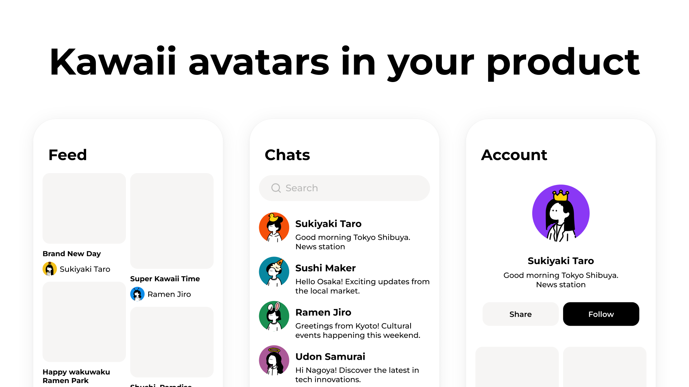

  

## Same seed, same avatar

Pass the same seed and you get the same avatar, every time. Pass a user id, an email, or a username — anything stable you already have.

<SeedDemo />

## No API to call

Rendering happens entirely in your app. The asset package includes embedded SVG strings, so nothing is fetched from Humation or anywhere else. Offline, in Node, in a Cloudflare Worker, inside a test — the output is the same.

There is no image generation involved. The artwork is drawn by people, and a seed only decides which parts are combined.

## Install

For React apps, install the component together with the asset package. Outside React, install `@humation/core` instead of `@humation/react` — see [Core](/core).

<HumationInstall
  packages={["@humation/react", "@humation/assets-humation-1"]}
/>

<CardGroup cols={3}>
  <Card title="@humation/react" href="/react" icon="atom">
    **React component**

    Use this to render avatars in React. It wraps core.
  </Card>
  <Card title="@humation/core" href="/core" icon="box">
    **Renderer and helpers**

    Use this for raw SVG output or to build a picker UI.
  </Card>
  <Card title="@humation/assets-humation-1" href="/parts" icon="palette">
    **Assets**

    Required either way. It holds the artwork itself.
  </Card>
</CardGroup>

## License

The packages and the artwork are MIT licensed. See [the repository](https://github.com/humation-labs/humation) for the license text.
